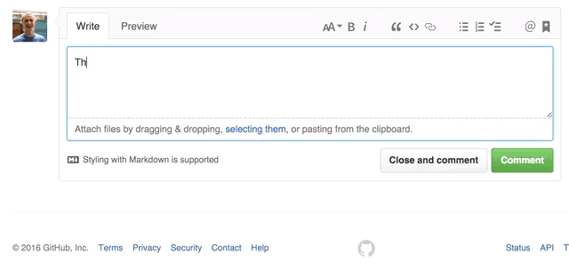

# Slash

Making the web better with Slack-like slash commands.



## Usage

1. Install the Slash extension [here](https://chrome.google.com/webstore/detail/slash/dkblejpmbmienbjpinbgebodokhpbkme)
2. Type a slash command like `/giphy` in any text field
3. Win!

Now, would you like to give it a try?

1. Go to the [welcome Github issue](https://github.com/jessepollak/slash/issues/1)
2. Click on the comment field at the bottom, say something witty, then type `/giphy`
3. Add the perfect GIF

## Current commands

* */giphy* - easily search and add a GIF to your text

## Contributing

Install the necessary node modules and start the development server.

```bash
$ npm install
$ npm run dev
```

Add the development build of the extension to your browser.

1. Navigate to `chrome://extensions/` in Chrome
2. Check *Developer Mode*
3. Click on *Load unpacked extension*
4. Add `slash/build`

## Credits

Thanks to [@schovi](https://github.com/schovi) for creating [webpack-chrome-extension](https://github.com/schovi/webpack-chrome-extension).
